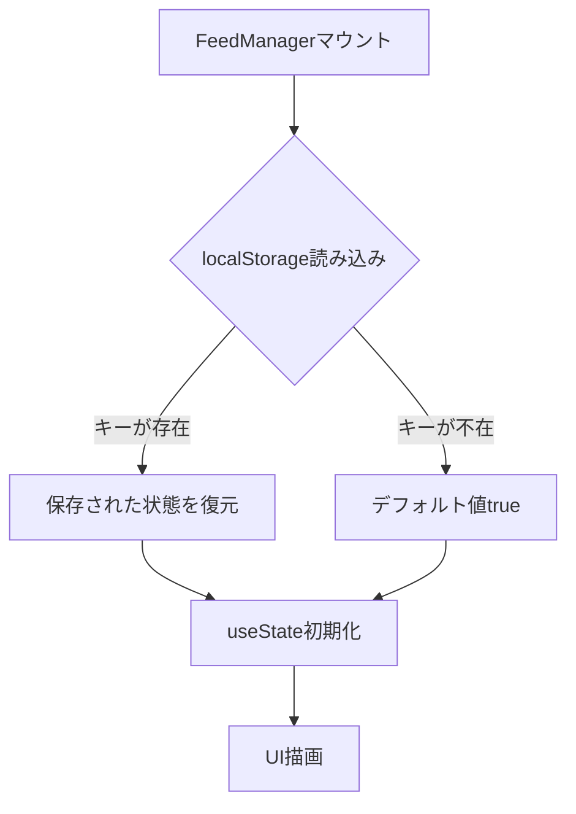
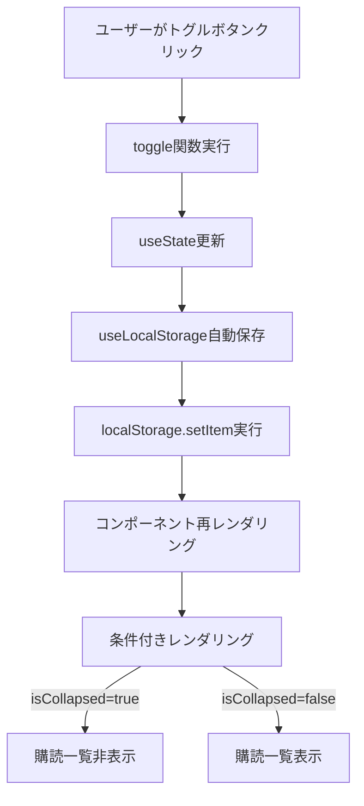

# Data Model: 購読フィード一覧の折りたたみ機能

**Created**: 2025-10-30
**Feature**: 010-improve-feed-article-access

## 概要

この機能は、既存のデータモデルに対して最小限の追加を行います。新規エンティティは作成せず、UI状態として折りたたみフラグを管理します。

---

## 1. 新規データエンティティ

### 1.1 Subscription List Visibility State

**概要**: 購読一覧の折りたたみ状態を表すUI状態

**ストレージ**: localStorage

**キー**: `rss_reader_subscriptions_collapsed`

**型定義**:
```typescript
type SubscriptionListCollapseState = boolean;
// true: 折りたたまれている（デフォルト）
// false: 展開されている
```

**属性**:
| 属性名 | 型 | 説明 | デフォルト値 | バリデーション |
|--------|-----|------|-------------|---------------|
| (値そのもの) | boolean | 折りたたみ状態 | `true` | N/A（boolean型） |

**永続化**:
- localStorage経由で保存
- JSON.stringify/parseで自動シリアライゼーション
- エラー時はデフォルト値（`true`）にフォールバック

**ライフサイクル**:
```
[初回訪問] → デフォルト値(true) → localStorage保存なし
    ↓
[ユーザーがトグル] → 状態変更(false) → localStorage保存
    ↓
[ページリロード] → localStorage読み込み(false) → 状態復元
    ↓
[ユーザーが再トグル] → 状態変更(true) → localStorage更新
```

---

## 2. 既存データモデルへの影響

### 2.1 Subscriptionエンティティ（変更なし）

既存の`Subscription`インターフェースに変更はありません：

```typescript
// /frontend/src/types/models.ts
export interface Subscription {
  id: string;
  url: string;
  title: string | null;
  customTitle: string | null;
  subscribedAt: string;
  lastFetchedAt: string | null;
  status: 'active' | 'error';
}
```

**理由**: 折りたたみ状態は個々のSubscriptionではなく、購読一覧全体のUI状態として管理

### 2.2 UIStateエンティティ（変更なし）

UIContextの`UIState`にも変更はありません：

```typescript
// /frontend/src/contexts/UIContext.tsx
interface UIState {
  isRefreshing: boolean;
  showWelcomeScreen: boolean;
  toast: { message: string; type: 'success' | 'error' | 'info' } | null;
}
```

**理由**: 折りたたみ状態はグローバルなUI状態ではなく、FeedManagerコンポーネント固有の状態として管理

---

## 3. 状態フロー

### 3.1 初期化フロー



### 3.2 状態更新フロー



### 3.3 永続化・復元フロー

```
[セッション1]
  ユーザー操作 → useState更新 → localStorage保存
                                    ↓
[ブラウザリロード]
                                    ↓
[セッション2]
  localStorage読み込み → useState初期化 → 状態復元
```

---

## 4. API契約

**この機能はフロントエンドのみで完結し、バックエンドAPIとの通信は発生しません。**

契約ディレクトリ `contracts/` は不要です。

---

## 5. データバリデーション

### 5.1 localStorage読み込み時

`useLocalStorage`フックが以下のバリデーションを実行：

```typescript
// /frontend/src/hooks/useLocalStorage.ts
const [storedValue, setStoredValue] = useState<T>(() => {
  try {
    const item = window.localStorage.getItem(key);
    return item ? JSON.parse(item) : initialValue; // ← バリデーション
  } catch (error) {
    console.error(`Error loading ${key} from localStorage:`, error);
    return initialValue; // ← エラー時はデフォルト値
  }
});
```

**バリデーション規則**:
| 条件 | 動作 |
|------|------|
| キーが存在しない | デフォルト値（`true`）を使用 |
| JSON.parse失敗 | デフォルト値（`true`）を使用 |
| boolean型以外 | TypeScriptの型チェックでコンパイルエラー |
| localStorage無効 | エラーハンドリング → デフォルト値 |

### 5.2 状態更新時

```typescript
const setValue = (value: T) => {
  try {
    setStoredValue(value);
    window.localStorage.setItem(key, JSON.stringify(value));
  } catch (error) {
    console.error(`Error saving ${key} to localStorage:`, error);
    // エラーでも状態は更新される（localStorage保存のみ失敗）
  }
};
```

**バリデーション規則**:
| 条件 | 動作 |
|------|------|
| setItem失敗 | コンソールエラー、状態は更新される |
| 容量超過 | エラーハンドリング → 状態のみ更新 |
| 無効な値 | TypeScriptの型チェックでコンパイルエラー |

---

## 6. 状態遷移図

```
┌─────────────────────────────────────────────────────┐
│                  Collapsed State                    │
│  isCollapsed = true                                 │
│  - 購読一覧非表示                                    │
│  - 購読件数表示                                      │
│  - トグルボタン: "▼ 購読フィードを表示"             │
└─────────────────────────────────────────────────────┘
                      │                    ▲
                      │ toggle()           │ toggle()
                      ▼                    │
┌─────────────────────────────────────────────────────┐
│                  Expanded State                     │
│  isCollapsed = false                                │
│  - 購読一覧表示                                      │
│  - 購読件数表示                                      │
│  - トグルボタン: "▲ 購読フィードを隠す"             │
└─────────────────────────────────────────────────────┘

補助アクション:
- expand(): 強制的に展開状態へ
- collapse(): 強制的に折りたたみ状態へ
```

---

## 7. メモリ/ストレージ容量

### 7.1 localStorageの使用量

```typescript
// キー: "rss_reader_subscriptions_collapsed"
// 値の例: "true" または "false"

キー長: 37 bytes
値長: 4-5 bytes（"true" or "false"）
合計: 約41-42 bytes
```

**容量評価**:
- localStorageの一般的な制限: 5-10 MB
- この機能の使用量: 42 bytes（0.000042 MB）
- 影響: **無視できるレベル**

### 7.2 メモリ使用量

```typescript
// useSubscriptionListCollapse フックの状態
{
  isCollapsed: boolean,  // 1 bit (実際は8 bytes)
  toggle: Function,      // 関数参照 (約50 bytes)
  expand: Function,      // 関数参照 (約50 bytes)
  collapse: Function     // 関数参照 (約50 bytes)
}

合計: 約158 bytes
```

**メモリ評価**: 無視できるレベル

---

## 8. エッジケース処理

### 8.1 localStorage無効環境

**シナリオ**: プライベートブラウジング、localStorage無効設定

**動作**:
```typescript
try {
  localStorage.setItem(key, value);
} catch (error) {
  // エラーハンドリング
  console.error('localStorage unavailable');
  // 状態はメモリ上で保持される（セッション中のみ）
}
```

**結果**: デフォルト値で動作、セッション終了で状態リセット

### 8.2 不正な値がlocalStorageに保存されている場合

**シナリオ**: 手動編集で`"invalid"`などが保存された

**動作**:
```typescript
JSON.parse("invalid") // → SyntaxError
catch (error) {
  return initialValue; // → デフォルト値 (true)
}
```

**結果**: 自動的にデフォルト値にフォールバック

### 8.3 複数タブでの同時操作

**シナリオ**: 同一ユーザーが複数タブで操作

**動作**:
- 各タブが独立した状態を保持
- 最後に操作したタブの状態がlocalStorageに保存
- 他のタブはリロードまで古い状態を保持

**Note**: `storage`イベントでタブ間同期も可能だが、今回は実装しない（YAGNI原則）

---

## 9. テストデータ

### 9.1 Unit Testで使用するモックデータ

```typescript
// useSubscriptionListCollapse.test.ts
const mockLocalStorage = {
  'rss_reader_subscriptions_collapsed': 'true'  // デフォルト状態
};

const mockLocalStorageExpanded = {
  'rss_reader_subscriptions_collapsed': 'false'  // 展開状態
};
```

### 9.2 Integration Testで使用するモックデータ

```typescript
// FeedManager.test.tsx
const mockSubscriptions: Subscription[] = [
  {
    id: '1',
    url: 'https://example.com/feed1',
    title: 'Test Feed 1',
    customTitle: null,
    subscribedAt: '2025-10-30T00:00:00Z',
    lastFetchedAt: null,
    status: 'active'
  },
  {
    id: '2',
    url: 'https://example.com/feed2',
    title: 'Test Feed 2',
    customTitle: 'Custom Title',
    subscribedAt: '2025-10-30T00:00:00Z',
    lastFetchedAt: null,
    status: 'active'
  }
];
```

---

## 10. データモデルのバージョン管理

**現在のバージョン**: 1.0

**将来の拡張可能性**:
1. 複数の折りたたみセクションに対応する場合:
   ```typescript
   interface CollapseState {
     subscriptions: boolean;
     filters: boolean;
     settings: boolean;
   }
   ```

2. タブ間同期が必要な場合:
   ```typescript
   window.addEventListener('storage', (e) => {
     if (e.key === 'rss_reader_subscriptions_collapsed') {
       setIsCollapsed(JSON.parse(e.newValue));
     }
   });
   ```

**現時点では実装しない理由**: YAGNI原則（必要になるまで作らない）

---

## まとめ

- **新規エンティティ**: 1つ（SubscriptionListCollapseState: boolean）
- **既存モデルへの影響**: なし
- **ストレージ使用量**: 42 bytes（無視できるレベル）
- **バリデーション**: 完全（エラーハンドリング済み）
- **エッジケース**: 対応済み

**次のステップ**: quickstart.md作成
